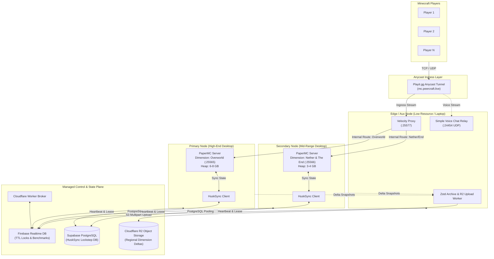
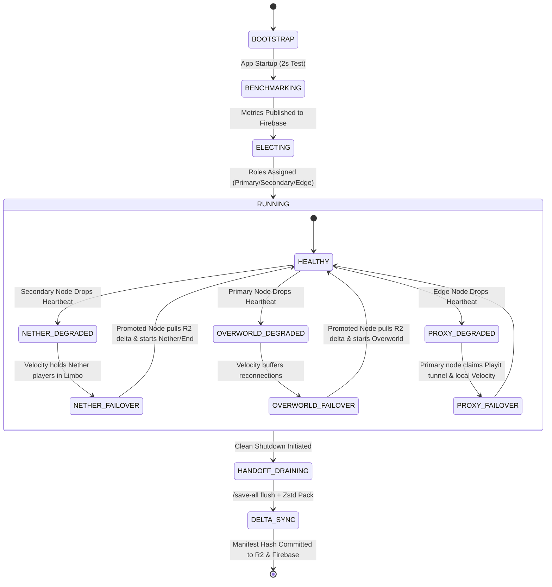

# 🌍 PeerCraft: Asymmetric Dynamic Cluster Architecture
> **One-Click Distributed Peer-to-Peer Minecraft Host**  
> *Hybrid Dimension-Sharded & Distributed Compute Architecture for 1–20 Players*

[](#-system-architecture)
[](https://papermc.io)
[](https://papermc.io/software/velocity)
[](https://william278.net/project/husksync)
[](LICENSE)

PeerCraft is an open-source, zero-cost desktop wrapper application (built with **Tauri**, **Rust**, and **React**) that federates a group of friends' local computers into a high-performance **Asymmetric Minecraft Server Cluster**.

Instead of running a monolithic server on a single computer, PeerCraft automatically benchmarks all participating machines, splits Minecraft dimensions across peer nodes according to hardware capacity (**Overworld** on the heaviest rig, **Nether & The End** on a secondary rig, and the **Velocity Proxy + Voice UDP + Delta Sync** on a lightweight laptop), and synchronizes global player state in lockstep using **HuskSync** and managed PostgreSQL.

---

## 📑 Table of Contents
1. [System Architecture](#-system-architecture)
2. [Dynamic Node Election & Role Allocation](#-dynamic-node-election--role-allocation)
3. [Dimension Sharding via Velocity Proxy](#-dimension-sharding-via-velocity-proxy)
4. [Global Cross-Server State Synchronization](#-global-cross-server-state-synchronization)
5. [Multi-Node Failover & Isolated Handoff State Machine](#-multi-node-failover--isolated-handoff-state-machine)
6. [Free-Tier Infrastructure Matrix](#-free-tier-infrastructure-matrix)
7. [Database Schemas & Security Rules](#-database-schemas--security-rules)
8. [Cloudflare Worker Broker & Token Gateway](#-cloudflare-worker-broker--token-gateway)
9. [Server Configuration & JVM Tuning Profiles](#-server-configuration--jvm-tuning-profiles)
10. [Project Directory Layout](#-project-directory-layout)
11. [Cold-Start Cluster Bootstrap Sequence](#-cold-start-cluster-bootstrap-sequence)

---

## 🏗 System Architecture

### High-Level Topology

```text
                            [ 1–20 Minecraft Clients ]
                                        │
                                        │  Public Ingress: mc.peercraft.live
                                        ▼
                          [ Playit.gg Anycast Tunnel ]
                                        │
               ┌────────────────────────┴────────────────────────┐
               │  TCP :25577 (Minecraft)       UDP :24454 (Voice) │
               ▼                                                 ▼
┌──────────────────────────────────────────────────────────────────────────┐
│ EDGE / AUXILIARY NODE (Laptop / Lightweight Client)                      │
│ ├─ Velocity Proxy (Modern Forwarding & Dimension Portal Router)           │
│ ├─ Simple Voice Chat UDP Relay                                           │
│ └─ Background Zstd Compressor & Cloudflare R2 Upload Daemon              │
└───────────────┬──────────────────────────────────────────┬───────────────┘
                │ Internal Peer Mesh                       │ Internal Peer Mesh
                │ TCP :25565                               │ TCP :25566
                ▼                                          ▼
┌──────────────────────────────┐           ┌──────────────────────────────┐
│ PRIMARY NODE (Heavy PC)      │           │ SECONDARY NODE (Medium PC)   │
│ ├─ PaperMC 1.20+ (Overworld) │           │ ├─ PaperMC 1.20+ (Nether/End)│
│ ├─ JRE 21 (6–8 GB Aikar G1GC)│           │ ├─ JRE 21 (3–4 GB Tuned G1GC)│
│ ├─ HuskSync Connector        │           │ ├─ HuskSync Connector        │
│ └─ Local Flush Sentinel      │           │ └─ Local Flush Sentinel      │
└───────────────┬──────────────┘           └──────────────┬───────────────┘
                │                                         │
                └────────────────────┬────────────────────┘
                                     │
       ┌─────────────────────────────┼─────────────────────────────┐
       ▼                             ▼                             ▼
[ Cloudflare Workers ]     [ Supabase PostgreSQL ]       [ Cloudflare R2 ]
• API & Secret Shield      • HuskSync Global Storage     • S3 Delta Storage
• Dynamic Role Election    • Inventories, Advancements   • Dimension MCA Files
• Ephemeral Lease Broker   • Ender Chests, Health/XP     • 10 GB Free / Zero Egress
       │
       ▼
[ Firebase Realtime DB ]
• Cluster Node Benchmarks
• 15s TTL Distributed Locks
• Dimension Manifest Registry
```



---

## ⚡ Dynamic Node Election & Role Allocation

When a user opens the PeerCraft desktop application, the local Rust daemon executes a **2-second non-intrusive benchmark** before publishing metrics to Firebase Realtime Database.

### 1. Benchmark Metrics Collected
* **Single-Thread CPU Performance ($C$):** Measures integer and floating-point arithmetic operations per millisecond (critical for the Minecraft single-threaded tick loop).
* **Available System RAM ($R$):** Available unreserved physical memory (in GB).
* **Upstream Bandwidth ($B$) & Latency ($L$):** Upstream throughput in Mbps and RTT ping to Cloudflare Edge.

### 2. Role Allocation Scoring Function
$$\text{Score} = (0.50 \times C) + (200 \times R) + (2.0 \times B) - (0.25 \times L)$$

| Role | Target Hardware | Allocation Minimums | Assigned Workload |
| :--- | :--- | :--- | :--- |
| **Primary Node** | Highest single-thread CPU & Desktop RAM | $\ge 5.5\text{ GB RAM}$, Score $\ge 1200$ | **Overworld PaperMC** (`port 25565`). Handles the main world ticking, redstone, entity spawning, and village AI. |
| **Secondary Node** | Mid-tier gaming PC / Secondary desktop | $\ge 2.8\text{ GB RAM}$, Score $\ge 800$ | **Nether & The End PaperMC** (`port 25566`). Handles Nether fortresses, Bastions, End cities, and dimension generation. |
| **Edge / Aux Node** | Ultra-light laptop / Mini PC | $\ge 1.0\text{ GB RAM}$ | **Velocity Proxy**, **Simple Voice Chat UDP Relay**, and background **Zstd archive compression / R2 upload queue** to offload disk I/O from active game hosts. |

> [!NOTE]
> If only 1 node is present in the session, PeerCraft falls back to a consolidated monolithic instance hosting all dimensions locally. If 2 nodes are present, the Secondary node co-hosts the Edge Proxy.

---

## 🌌 Dimension Sharding via Velocity Proxy

Dimensions are completely decoupled into distinct Paper processes running across different machines on the local mesh or peer network:

```text
Player in Overworld (Node A: 25565) ───[ Steps into Nether Portal ]───┐
                                                                      │
Velocity Proxy intercepts portal switch event                         │
  ├─ 1. Paper Overworld flushes player NBT to Supabase (HuskSync)     ▼
  ├─ 2. Velocity redirects player connection to Node B: 25566 ────────┘
  └─ 3. Paper Nether loads player state from Supabase in < 80ms
Player spawns seamlessly inside the Nether with identical inventory!
```

### Key Technical Properties:
1. **Zero Client Disconnects:** Velocity seamlessly switches backend connections using Minecraft 1.20 modern forwarding.
2. **Modern Forwarding Security:** Every backend Paper instance verifies player cryptographic signatures via `velocity.secret`. Direct connections bypassing Velocity are automatically rejected.
3. **Proximity Audio Synchronization:** Simple Voice Chat operates on UDP `24454` at the Edge Proxy, routing spatial audio across all dimensions and peer nodes without splitting voice channels.

---

## 🔄 Global Cross-Server State Synchronization

Player data consistency across dimension-sharded nodes is guaranteed by **HuskSync** backed by **Supabase PostgreSQL** (Free Tier):

### Synchronized Data Attributes
* **Inventory & Equipment:** Hotbar, main inventory, off-hand, armor slots.
* **Ender Chest:** Complete Ender chest contents with NBT preservation.
* **Vitals & Status:** Health, hunger, saturation, exhaustion, active potion effects, fire ticks.
* **Experience:** Exact XP points and level progression.
* **Advancements & Statistics:** Completed advancement trees, kill counts, custom scoreboard criteria.
* **Location Tracking:** Dimension-specific coordinates for return portals.

### Database Connection Configuration (`config.yml` for HuskSync)
```yaml
database:
  type: POSTGRESQL
  host: db.your-project.supabase.co
  port: 5432
  database: postgres
  username: postgres
  password: 'YOUR_SUPABASE_DB_PASSWORD'
  connection_pool:
    maximum_pool_size: 5
    minimum_idle: 2
    connection_timeout: 10000
  ssl: true
```

---

## 🛡 Multi-Node Failover & Isolated Handoff State Machine

PeerCraft isolates failure domains per dimension so that an issue in one dimension never crashes the entire server.



### Failover Handling Scenarios:

#### 1. Secondary Node (Nether/End) Failure
* **Overworld Gameplay Unaffected:** Players currently in the Overworld experience **zero lag or downtime**.
* **Portal Safety Guard:** If a player steps into a Nether/End portal during failover, Velocity halts the transfer and displays: `[PeerCraft] Nether is migrating to a backup peer. Standby (15s)...`
* **Isolated Migration:** The cluster elects a standby node (or the Primary node as fallback), pulls the latest `worlds/nether/` delta from Cloudflare R2, starts the secondary Paper instance, and resumes portal routing.

#### 2. Primary Node (Overworld) Failure
* Velocity buffers player connections while Firebase detects the expired 15-second TTL lease.
* The Secondary or next highest-scoring node is promoted to Primary.
* The promoted node downloads the latest Overworld delta, boots the server, and Velocity routes players into the new instance with full state intact.

---

## 💰 Free-Tier Infrastructure Matrix

| Layer | Provider | Free Tier Allowance | PeerCraft Utilization | Egress / Cost |
| :--- | :--- | :--- | :--- | :--- |
| **Ingress & Tunnel** | [Playit.gg](https://playit.gg) | Unlimited TCP/UDP Tunnels | Static public domain (`mc.peercraft.live`), TCP port `25577`, UDP port `24454` | **$0.00** / Free |
| **API & Token Gateway** | [Cloudflare Workers](https://workers.cloudflare.com) | 100,000 requests / day | Role election, TTL lease broker, STS storage tokens | **$0.00** / Free |
| **Delta Object Storage** | [Cloudflare R2](https://www.cloudflare.com/developer-platform/r2/) | 10 GB storage, 1M write ops/mo | Region `.mca` differential chunk snapshots | **$0.00** (Zero Egress Fees) |
| **Cluster Coordination** | [Firebase Realtime DB](https://firebase.google.com) | 1 GB storage, 10 GB transfer/mo | 15-second TTL leases, node benchmark registry, topology | **$0.00** / Free |
| **State Synchronization** | [Supabase](https://supabase.com) (PostgreSQL) | 500 MB DB, 2 direct poolers | HuskSync player inventory, Ender chest, and advancement sync | **$0.00** / Free |

---

## 🗄 Database Schemas & Security Rules

### 1. Firebase Realtime Database Schema (`database.json`)

```json
{
  "cluster": {
    "state": "RUNNING",
    "elected_at": 1718000000000,
    "nodes": {
      "node_win_alpha_01": {
        "nodeName": "Desktop-Ryzen-5800X",
        "cpuSingleThreadScore": 2850,
        "availableRamMb": 16384,
        "upstreamBandwidthMbps": 50,
        "pingMs": 12,
        "compositeScore": 4725.0,
        "lastSeen": 1718000000000,
        "status": "ONLINE"
      },
      "node_laptop_beta_02": {
        "nodeName": "Laptop-Intel-i5",
        "cpuSingleThreadScore": 1420,
        "availableRamMb": 7800,
        "upstreamBandwidthMbps": 30,
        "pingMs": 24,
        "compositeScore": 2330.0,
        "lastSeen": 1718000000000,
        "status": "ONLINE"
      }
    },
    "roles": {
      "primary": {
        "node_id": "node_win_alpha_01",
        "node_name": "Desktop-Ryzen-5800X",
        "dimension": "overworld",
        "port": 25565,
        "lease_expires_at": 1718000015000,
        "status": "ACTIVE",
        "tps": 20.0,
        "connected_players": 4,
        "last_heartbeat": 1718000000000
      },
      "secondary": {
        "node_id": "node_win_alpha_01",
        "node_name": "Desktop-Ryzen-5800X",
        "dimension": "nether_end",
        "port": 25566,
        "lease_expires_at": 1718000015000,
        "status": "ACTIVE",
        "tps": 20.0,
        "connected_players": 1,
        "last_heartbeat": 1718000000000
      },
      "edge": {
        "node_id": "node_laptop_beta_02",
        "node_name": "Laptop-Intel-i5",
        "role": "edge",
        "services": ["velocity_proxy", "simple_voice_chat", "r2_delta_offloader"],
        "proxy_port": 25577,
        "voice_port": 24454,
        "lease_expires_at": 1718000015000,
        "status": "ACTIVE",
        "last_heartbeat": 1718000000000
      }
    },
    "manifests": {
      "overworld": {
        "version": 42,
        "sha256": "a3f89b...",
        "chunk_count": 1840,
        "uploaded_by": "node_win_alpha_01",
        "uploaded_at": 1718000000000,
        "r2_key": "worlds/overworld/manifest.json"
      },
      "nether_end": {
        "version": 38,
        "sha256": "c7e12d...",
        "chunk_count": 620,
        "uploaded_by": "node_win_alpha_01",
        "uploaded_at": 1718000000000,
        "r2_key": "worlds/nether_end/manifest.json"
      }
    }
  }
}
```

### 2. Firebase Security Rules (`database.rules.json`)

```json
{
  "rules": {
    ".read": "auth != null",
    "cluster": {
      "nodes": {
        "$nodeId": {
          ".write": "auth != null && (!data.exists() || data.child('nodeId').val() === auth.uid || newData.child('nodeId').val() === auth.uid)"
        }
      },
      "roles": {
        ".write": "auth != null",
        "primary": {
          ".validate": "newData.hasChildren(['node_id', 'lease_expires_at', 'status'])"
        },
        "secondary": {
          ".validate": "newData.hasChildren(['node_id', 'lease_expires_at', 'status'])"
        },
        "edge": {
          ".validate": "newData.hasChildren(['node_id', 'lease_expires_at', 'status'])"
        }
      },
      "manifests": {
        ".write": "auth != null"
      }
    }
  }
}
```

### 3. Supabase / PostgreSQL HuskSync DDL Schema (`schema.sql`)

```sql
-- Create HuskSync Users Table
CREATE TABLE IF NOT EXISTS husksync_users (
    uuid UUID PRIMARY KEY,
    username VARCHAR(16) NOT NULL
);

CREATE INDEX IF NOT EXISTS idx_husksync_username ON husksync_users(username);

-- Create HuskSync User Data Records Table
CREATE TABLE IF NOT EXISTS husksync_user_data (
    id BIGSERIAL PRIMARY KEY,
    player_uuid UUID NOT NULL REFERENCES husksync_users(uuid) ON DELETE CASCADE,
    version INT NOT NULL DEFAULT 1,
    timestamp TIMESTAMPTZ NOT NULL DEFAULT CURRENT_TIMESTAMP,
    save_cause VARCHAR(32) NOT NULL,
    pinned BOOLEAN NOT NULL DEFAULT FALSE,
    inventory_data BYTEA,
    ender_chest_data BYTEA,
    potion_effects_data BYTEA,
    advancements_data BYTEA,
    statistics_data BYTEA,
    persistent_data BYTEA,
    health DOUBLE PRECISION NOT NULL DEFAULT 20.0,
    max_health DOUBLE PRECISION NOT NULL DEFAULT 20.0,
    hunger INT NOT NULL DEFAULT 20,
    saturation REAL NOT NULL DEFAULT 5.0,
    experience_level INT NOT NULL DEFAULT 0,
    experience_progress REAL NOT NULL DEFAULT 0.0,
    game_mode VARCHAR(16) NOT NULL DEFAULT 'SURVIVAL',
    is_flying BOOLEAN NOT NULL DEFAULT FALSE
);

CREATE INDEX IF NOT EXISTS idx_husksync_data_player_time 
ON husksync_user_data(player_uuid, timestamp DESC);

-- Create HuskSync Current Active Snapshots Table (for O(1) read latency)
CREATE TABLE IF NOT EXISTS husksync_current_snapshots (
    player_uuid UUID PRIMARY KEY REFERENCES husksync_users(uuid) ON DELETE CASCADE,
    data_id BIGINT NOT NULL REFERENCES husksync_user_data(id) ON DELETE CASCADE,
    updated_at TIMESTAMPTZ NOT NULL DEFAULT CURRENT_TIMESTAMP
);
```

---

## 🌐 Cloudflare Worker Broker & Token Gateway

The Cloudflare Worker located at [`workers/index.ts`](file:///e:/PeerCraft/workers/index.ts) manages authentication, executes dynamic election scoring, manages isolated dimension failover, and securely distributes ephemeral credentials for Playit and Cloudflare R2 without bundling secrets inside client desktop binaries.

### Supported API Endpoints:
* `POST /api/nodes/benchmark` — Submits local hardware metrics and receives composite fitness score.
* `POST /api/cluster/elect` — Solves role assignments based on active cluster topology.
* `POST /api/cluster/heartbeat` — Refreshes 15-second TTL lease and updates TPS/player telemetry.
* `POST /api/cluster/failover` — Executes dimension-isolated failover when a node goes dark.
* `GET /api/cluster/topology` — Dynamic backend discovery for the Velocity Proxy.
* `POST /api/credentials/storage` — Generates scoped R2 S3 access keys per dimension.
* `POST /api/credentials/tunnel` — Issues Playit Anycast session token to the elected Edge node.

---

## ⚙️ Server Configuration & JVM Tuning Profiles

### 1. Velocity Proxy Configuration (`velocity.toml`)

```toml
[servers]
overworld = "127.0.0.1:25565"
nether_end = "127.0.0.1:25566"

try = [
    "overworld"
]

[forced-hosts]
"mc.peercraft.live" = ["overworld"]

bind = "0.0.0.0:25577"
motd = "<gradient:#4facfe:#00f2fe>PeerCraft Asymmetric Dynamic Cluster</gradient>"
show-max-players = 20
player-info-forwarding-mode = "modern"
forwarding-secret-file = "velocity.secret"
online-mode = false
force-key-authentication = false
```

### 2. PaperMC Velocity Modern Forwarding (`config/paper-global.yml`)

Applied to both Primary (Overworld) and Secondary (Nether/End) instances:

```yaml
proxies:
  velocity:
    enabled: true
    online-mode: false
    secret: "PEERCRAFT_SHARED_VELOCITY_SECRET_KEY_HEX"
```

### 3. Backend `server.properties`

#### Primary Node (Overworld Instance - Port 25565)
```properties
server-port=25565
online-mode=false
allow-nether=true
allow-end=true
view-distance=8
simulation-distance=6
network-compression-threshold=256
max-players=20
enable-rcon=true
rcon.port=25575
rcon.password=PEERCRAFT_INTERNAL_RCON_PASS_SECURE
sync-chunk-writes=true
```

#### Secondary Node (Nether & End Instance - Port 25566)
```properties
server-port=25566
online-mode=false
allow-nether=true
allow-end=true
view-distance=8
simulation-distance=6
network-compression-threshold=256
max-players=20
enable-rcon=true
rcon.port=25576
rcon.password=PEERCRAFT_INTERNAL_RCON_PASS_SECURE
sync-chunk-writes=true
```

---

### 4. JVM Startup Profiles Tailored Per Node Role

#### A. Primary Node (Overworld — Heavy Compute)
* Launcher: [`scripts/start-primary.sh`](file:///e:/PeerCraft/scripts/start-primary.sh) / [`scripts/start-primary.bat`](file:///e:/PeerCraft/scripts/start-primary.bat)

```bash
java -Xms6G -Xmx8G \
  -XX:+UseG1GC \
  -XX:+ParallelRefProcEnabled \
  -XX:MaxGCPauseMillis=200 \
  -XX:+UnlockExperimentalVMOptions \
  -XX:+DisableExplicitGC \
  -XX:+AlwaysPreTouch \
  -XX:G1NewSizePercent=30 \
  -XX:G1MaxNewSizePercent=40 \
  -XX:G1ReservePercent=20 \
  -XX:InitiatingHeapOccupancyPercent=15 \
  -XX:G1MixedGCLiveThresholdPercent=90 \
  -XX:G1RSetUpdatingPauseTimePercent=5 \
  -XX:SurvivorRatio=32 \
  -XX:+PerfDisableSharedMem \
  -XX:MaxTenuringThreshold=1 \
  -Dusing.aikars.flags=https://mcflags.emc.gs \
  -Daikars.new.flags=true \
  -jar bin/paper.jar --nogui --port 25565
```

#### B. Secondary Node (Nether & The End — Medium Compute)
* Launcher: [`scripts/start-secondary.sh`](file:///e:/PeerCraft/scripts/start-secondary.sh) / [`scripts/start-secondary.bat`](file:///e:/PeerCraft/scripts/start-secondary.bat)

```bash
java -Xms3G -Xmx4G \
  -XX:+UseG1GC \
  -XX:+ParallelRefProcEnabled \
  -XX:MaxGCPauseMillis=150 \
  -XX:+UnlockExperimentalVMOptions \
  -XX:+DisableExplicitGC \
  -XX:+AlwaysPreTouch \
  -XX:G1NewSizePercent=25 \
  -XX:G1MaxNewSizePercent=35 \
  -XX:G1ReservePercent=15 \
  -XX:InitiatingHeapOccupancyPercent=20 \
  -XX:G1MixedGCLiveThresholdPercent=90 \
  -XX:G1RSetUpdatingPauseTimePercent=5 \
  -XX:SurvivorRatio=32 \
  -XX:+PerfDisableSharedMem \
  -XX:MaxTenuringThreshold=1 \
  -Dusing.aikars.flags=https://mcflags.emc.gs \
  -Daikars.new.flags=true \
  -jar bin/paper.jar --nogui --port 25566
```

#### C. Edge / Aux Node (Velocity Proxy + Simple Voice Chat + Delta Offloader)
* Launcher: [`scripts/start-edge.sh`](file:///e:/PeerCraft/scripts/start-edge.sh) / [`scripts/start-edge.bat`](file:///e:/PeerCraft/scripts/start-edge.bat)

```bash
java -Xms512M -Xmx1024M \
  -XX:+UseG1GC \
  -XX:G1HeapRegionSize=4M \
  -XX:+UnlockExperimentalVMOptions \
  -XX:+ParallelRefProcEnabled \
  -XX:+AlwaysPreTouch \
  -XX:MaxGCPauseMillis=50 \
  -XX:+DisableExplicitGC \
  -Dvelocity.packet-decode-logging=false \
  -jar bin/velocity.jar
```

---

## 📁 Project Directory Layout

```text
peercraft/
├── src-tauri/
│   ├── src/
│   │   ├── main.rs                 # Tauri application bootstrap & tray management
│   │   ├── cluster/
│   │   │   ├── mod.rs              # Cluster coordinator module
│   │   │   ├── benchmark.rs        # 2-second CPU/RAM/Network benchmark runner
│   │   │   ├── election.rs         # Role election client & CAS validator
│   │   │   └── heartbeat.rs        # 5-second lease heartbeat emitter
│   │   ├── process/
│   │   │   ├── supervisor.rs       # Multi-process supervisor (Paper, Velocity, Playit)
│   │   │   ├── killer.rs           # Port collision cleanup & graceful SIGTERM
│   │   │   └── sleep_inhibitor.rs  # OS sleep block (Windows/macOS/Linux)
│   │   ├── sync/
│   │   │   ├── delta_engine.rs     # Differential chunk sync & zstd compressor
│   │   │   ├── manifest.rs         # SHA-256 dimension hash generator
│   │   │   └── r2_client.rs        # Scoped S3 upload/download client
│   │   └── rcon/
│   │       └── client.rs           # Async RCON query & chunk flush dispatcher
│   ├── Cargo.toml
│   └── tauri.conf.json
├── src/
│   ├── components/
│   │   ├── ClusterTopology.tsx     # Dynamic node role visualization & mesh graph
│   │   ├── BenchmarkModal.tsx      # Real-time benchmark gauges (CPU/RAM/Net)
│   │   ├── DimensionStatus.tsx     # Overworld vs Nether/End TPS & entity counters
│   │   ├── FailoverAlert.tsx       # Live failover notifications & migration status
│   │   └── ConsoleViewer.tsx       # Tabbed console for Velocity, Overworld, Nether
│   ├── App.tsx
│   └── index.css
├── bin/                            # Portable runtime dependencies
│   ├── jre21/                      # Embedded Eclipse Temurin OpenJDK 21
│   ├── paper.jar                   # Verified PaperMC 1.20+ executable
│   ├── velocity.jar                # Velocity Proxy binary
│   └── playit                      # Playit.gg CLI Anycast tunnel binary
├── scripts/                        # Role-specific startup launchers
│   ├── start-primary.sh            # Overworld bash launcher (Aikar G1GC 6-8GB)
│   ├── start-primary.bat           # Overworld Windows batch launcher
│   ├── start-secondary.sh          # Nether/End bash launcher (Tuned G1GC 3-4GB)
│   ├── start-secondary.bat         # Nether/End Windows batch launcher
│   ├── start-edge.sh               # Velocity proxy & Voice UDP launcher (512MB-1GB)
│   └── start-edge.bat              # Velocity proxy Windows batch launcher
├── servers/                        # Local runtime instances (gitignored)
│   ├── overworld/                  # Overworld Paper instance directory
│   ├── nether_end/                 # Nether & The End Paper instance directory
│   └── velocity/                   # Velocity proxy directory & velocity.toml
├── workers/
│   ├── wrangler.toml               # Cloudflare Worker configuration
│   └── index.ts                    # Cluster election API & token broker
├── database.json                   # Firebase Realtime DB schema template
├── database.rules.json             # Firebase Realtime DB security rules
├── schema.sql                      # Supabase PostgreSQL HuskSync DDL schema
└── README.md
```

---

## 🚀 Cold-Start Cluster Bootstrap Sequence

When initializing a brand new world across the cluster:

1. **Benchmark & Elect:** All joining peers execute the local benchmark. The strongest node is assigned **Primary (Overworld)**, the second strongest **Secondary (Nether/End)**, and an aux/laptop node **Edge (Velocity)**.
2. **Schema & EULA Deployment:** Database tables are verified in Supabase PostgreSQL; `eula.txt` and `velocity.secret` are automatically deployed across all nodes.
3. **Overworld Genesis:** Primary Node starts headlessly, generates spawn chunks, enforces `/worldborder set 10000`, executes `/save-all flush`, and syncs the initial baseline hash to Cloudflare R2.
4. **Dimension Mesh Activation:** Secondary Node boots Nether/End; Edge Node starts Velocity; Playit Anycast tunnel opens `mc.peercraft.live`.
5. **Ready for Players:** Friends connect to `mc.peercraft.live`. Velocity transparently routes players to Overworld on Node A and dimension switches to Node B while HuskSync maintains synchronized player inventories across the cluster.
